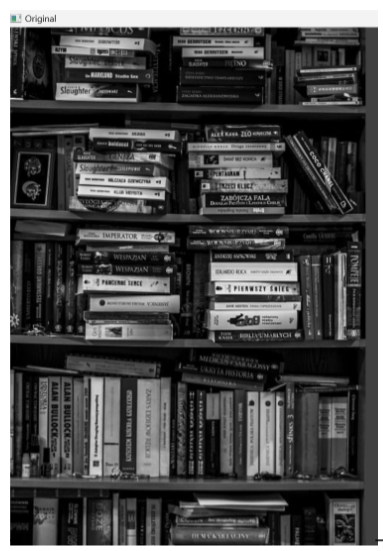
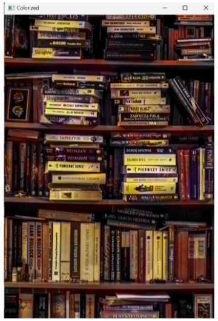

# 🎨 Gray2Color – Black & White Image Colorization

Gray2Color is a deep learning-based tool that colorizes black and white images using OpenCV and a pre-trained CNN model.  
This project uses a pre-trained Caffe model and color cluster centers to generate realistic colorizations.

---

## 🧠 How It Works
- Loads a pre-trained model (colorization_release_v2.caffemodel)

- Uses cluster centers (pts_in_hull.npy) to restore color information

- Converts the input image from grayscale to LAB color space

- Infers AB channels using the model and reconstructs the final image

---

## ⚙️ Requirements

- Python 3.7+
- OpenCV
- NumPy

---

## 🚀 How to Run

1) Install dependencies using pip:

```bash
pip install opencv-python numpy
```

2) Place your black and white image inside the images/ folder (You can use the images already in the repository also), then run:

```bash
python BWColor.py --image images/sample_bw_image.jpg
```
✅The original and colorized images will be displayed in separate windows.

---
## 🔍Results

| Grayscale Input | Colorized Output |
|-----------------|------------------|
|  |  |

---

## 🤝 Credits
Model and resources by Richard Zhang et al.
GitHub: [richzhang/colorization](http://github.com/richzhang/colorization)


